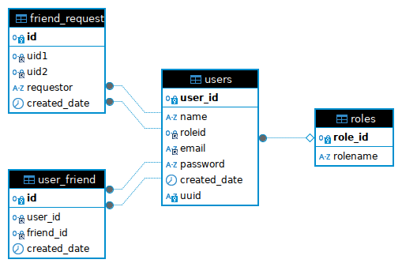

# Friend System API with Autocomplete and JWT Authentication

This Spring Boot project implements a comprehensive friend system API that includes features like friend requests, managing friendships, and user authentication with JWT. Additionally, it offers an autocomplete feature using the Trie data structure.

## Table of Contents

- [Features](#features)
- [Getting Started](#getting-started)
- [Project Structure](#project-structure)
- [API Endpoints](#api-endpoints)
- [Database Design](#database-design)
- [Technologies Used](#technologies-used)
- [Contributing](#contributing)
- [License](#license)

## Features

- **Friend System API**: Send, accept, and manage friend requests.
- **User Management**: Create and log in users with secure authentication.
- **JWT Implementation**: Secure API endpoints using JSON Web Tokens.
- **Autocomplete**: Implement a Trie-based autocomplete feature for fast search suggestions.

## Getting Started

### Prerequisites

- Java 11 or higher
- Maven or Gradle
- MySQL or any other relational database

### Installation

1. **Clone the repository:**

   ```bash
   git clone https://github.com/yourusername/friend-system-api.git
   cd friend-system-api
   ```
2. **Configure the databases:**
    spring.datasource.url=jdbc:mysql://localhost:3306/friend_system_db
    spring.datasource.username=yourusername
    spring.datasource.password=yourpassword

3. **Build the project:**
    mvn clean install

## API Endpoints

#### POST Login user
http://localhost:8080/auth/login

Body 
```json
    {
        "email": "sah123@gmail.com",
        "password": "qwerty"
    }
```
This is a POST request, submitting data to an API via the request body. This request submits JSON data, and the data is reflected in the response.
A successful POST request typically returns a 200 OK or 201 Created response code. Returns JWT Token


#### POST Signup user

http://localhost:8080/auth/signup

```json
    {
      "name": "Rajpal raina",
      "password": "qwerty",
      "confirmPass": "qwerty",
      "email": "test9@gmail.com",
      "agreeterms":true
   }
```
Creating new user , Returns JWT token if user successfully created.

#### GET UserList
http://localhost:8080/api/search?q=Jo&page=0&size=10

This API returns list of users whose name starts with Jo , pagination is implemented (Backend calls DB each time for this request).

**JWT Token needs to be added.**

#### GET Autocomplete Request
http://localhost:8080/api/search/ta?q=raj

Returns list of users whose name starts with raj (It use Trie,backend do not call db each time for this request , Inmemory Data Structure is used to fulfill this request).
Scheduler is running which recreate the trie object to cater new created users.

**JWT Token needs to be added.**

Response JSON
```json
        [
            {
                "id": 0,
                "name": "Rajesh",
                "searchUrl": "http:/localhost:8080/api/search?q=raj&page=0&size=10"
            },
            {
                "id": 1,
                "name": "Rajpal Raina",
                "searchUrl": "http:/localhost:8080/api/search?q=raj&page=0&size=10"
            },
            {
                "id": 2,
                "name": "Raju",
                "searchUrl": "http:/localhost:8080/api/search?q=raj&page=0&size=10"
            }
        ]
```

#### POST Friend Request
http://localhost:8080/api/freq

Sending friend request to user using receiver id.

Sent JSON
```json
    {
         "receiverId": "34"
    }
```

#### PATCH Response To FriendRequest
http://localhost:8080/api/freq?userId=34&action=ACCEPT

Respond to friend request , return BAD REQUEST if action not allowed

action param accept (ACCEPT OR DENY)
userId param represent id of the user who sent the request.

#### GET Get friend req sent
http://localhost:8080/api/freq?sent=true&page=0&size=10

Return list of friend request sent by the logged user

#### GET Get friend list
http://localhost:8080/api/flist?page=0&size=10

Return list of friend of logged user

## Database Design 


This ER diagram represents a system for managing user relationships, such as friendships and friend requests, with an additional layer of role-based user management. Here is a description of the entities and their relationships:

1. Users Table
    user\_id: The primary key for the users table. This uniquely identifies each user in the system.
    name: The name of the user.
    roleid: A foreign key linking to the roles table, specifying the user's role in the system.
    email: The email address of the user, likely used for login and communication purposes.
    password: The password for the user, stored securely.
    created\_date: The date and time when the user account was created.
    uuid: A universally unique identifier for the user, often used for public-facing identification.

2. Roles Table
    role\_id: The primary key for the roles table. This uniquely identifies each role.
    rolename: The name of the role, such as 'admin', 'user', etc.

3. Friend Request Table (friend\_request)
    id: The primary key for the friend\_request table. This uniquely identifies each friend request.
    uid1: A foreign key referencing the user_id in the users table, representing the first user involved in the friend request.
    uid2: A foreign key referencing the user_id in the users table, representing the second user involved in the friend request.
    requestor: Identifies which user initiated the friend request.
    created_date: The date and time when the friend request was created.

4. User Friend Table (user_friend) // Note: Store a single entry in both way meaning for a row with user_id 1 and friend_id 2 also store user_id 2 and friend_id 1 so that indexing can be applied on a single column

    id: The primary key for the user_friend table. This uniquely identifies each friendship.
    user_id: A foreign key referencing the user_id in the users table, representing one of the users in the friendship.
    friend_id: A foreign key referencing the user_id in the users table, representing the other user in the friendship.
    created_date: The date and time when the friendship was established.


### Relationships

Users and Roles: A many-to-one relationship between users and roles. Each user has one role, but a role can be associated with many users.
Friend Requests: Each friend request involves two users (uid1 and uid2), both of which are foreign keys referencing the user_id in the users table.
Friendships: Similar to friend requests, each friendship involves two users (user_id and friend_id), both of which are foreign keys referencing the user_id in the users table.

### Summary:
This ER diagram models a basic social system where users can send and accept friend requests, forming friendships. Users have roles that dictate their permissions or abilities within the system.

## Technologies Used

This project leverages several technologies and libraries to deliver a robust and scalable application:

- **Spring Boot**: A powerful, convention-over-configuration framework that simplifies the development of Java applications. Spring Boot provides various features such as embedded servers, simplified dependency management, and production-ready tools, making it the ideal choice for building RESTful APIs and microservices.

- **Spring Data JPA**: A part of the larger Spring Data ecosystem, Spring Data JPA provides easy integration with JPA (Java Persistence API) and ORM (Object-Relational Mapping) technologies like Hibernate. It abstracts much of the boilerplate code required to interact with relational databases, offering features such as repository support, custom query methods, and transaction management.

- **JJWT (Java JWT)**: A comprehensive Java library for creating and verifying JSON Web Tokens (JWT). JJWT is easy to use, robust, and follows the JWT specification closely, making it an excellent choice for implementing token-based authentication and authorization in your Spring Boot applications.

### Other Dependencies

- **MySQL**: A popular relational database used to store application data. Spring Data JPA is used to interact with MySQL.
- **Maven**: A build automation tool used for managing dependencies, compiling, and packaging the project.
- **JUnit & Mockito**: Libraries used for unit testing the application to ensure code quality and reliability.
- **Lombok**: A Java library that helps reduce boilerplate code by generating getter, setter, equals, hashCode, and toString methods automatically.

### Additional Libraries

- **Spring Security**: Provides authentication, authorization, and other security features for the application, including integration with JJWT for token-based authentication.

These technologies work together to create a scalable, secure, and maintainable application. Each of them plays a crucial role in ensuring that the system is both robust and easy to extend.

## License

This project is licensed under the MIT License
